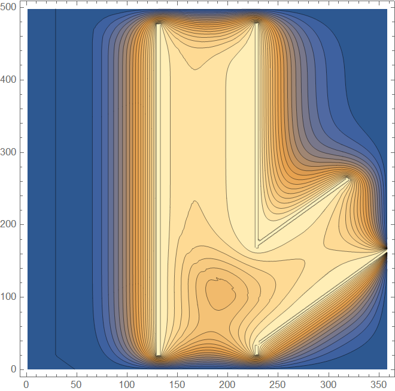
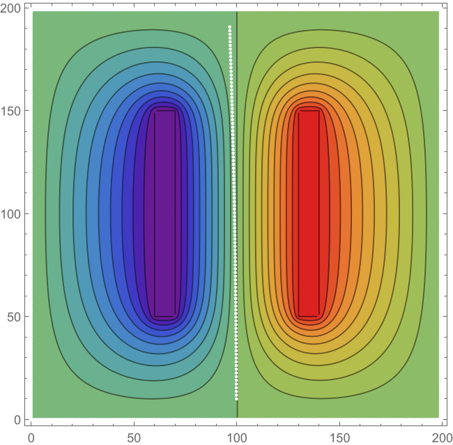
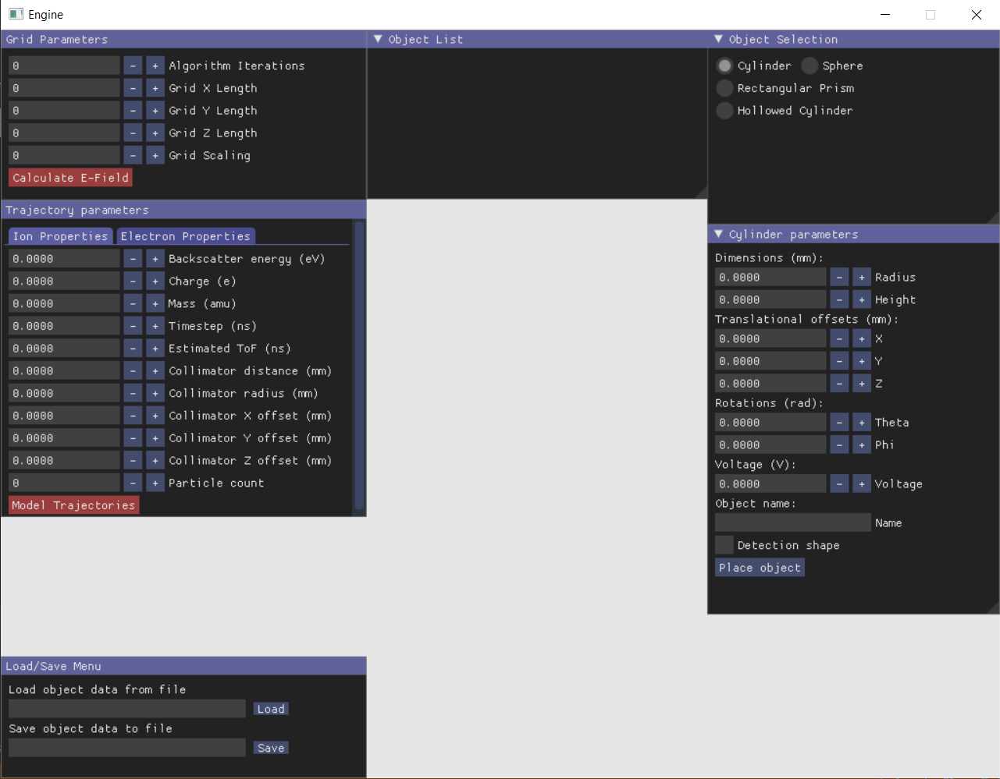

# Electric Field Modeler
Purpose: To study the electric fields within an energy detector.

**Locking Repository** - Old work, multiple bugs

**Undergraduate Research**
- C++ application layer (SDL for windowing, ImGUI for UI)
- Numerical Laplacians to compute electric potentials/fields
- 4th order Runge-Kutta trajectory predictions

##Parallel plate capacitor demonstration

##Basic UI calculator

